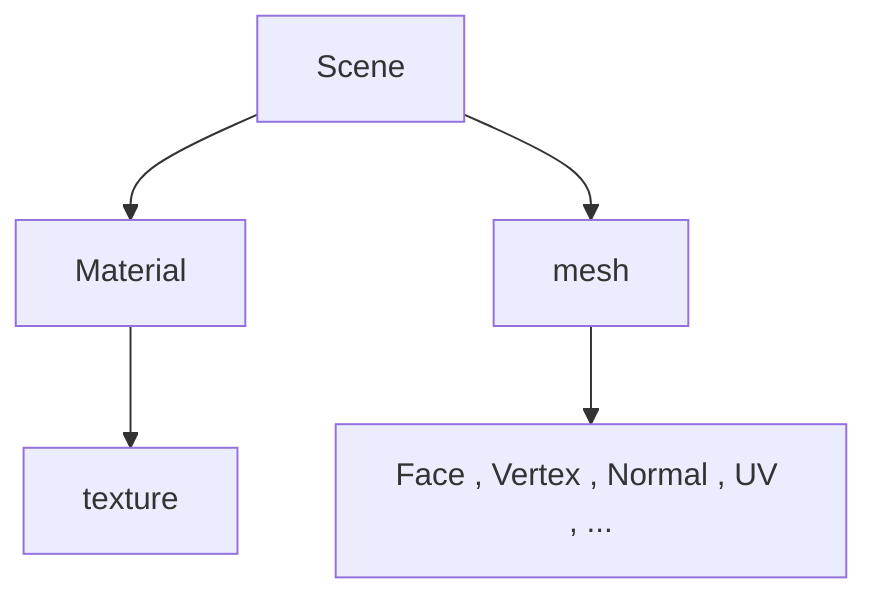

https://assimp.sourceforge.net/lib_html/index.html



其中face 相当于 index

官方代码
```cpp
#include <assimp/Importer.hpp>      // C++ importer interface
#include <assimp/scene.h>           // Output data structure
#include <assimp/postprocess.h>     // Post processing flags
#include "print.h"
bool import(const std::string& pFile)
{
    Assimp::Importer importer;
    const aiScene* scene = importer.ReadFile(pFile,
        aiProcess_CalcTangentSpace |
        aiProcess_Triangulate |
        aiProcess_JoinIdenticalVertices |
        aiProcess_SortByPType);

    if (!scene)
    {
        print(importer.GetErrorString());
        return false;
    }
    print("导入成功");
    return true;
}


int main()
{
    import("./resources/IronMan/IronMan.obj");
}
```


