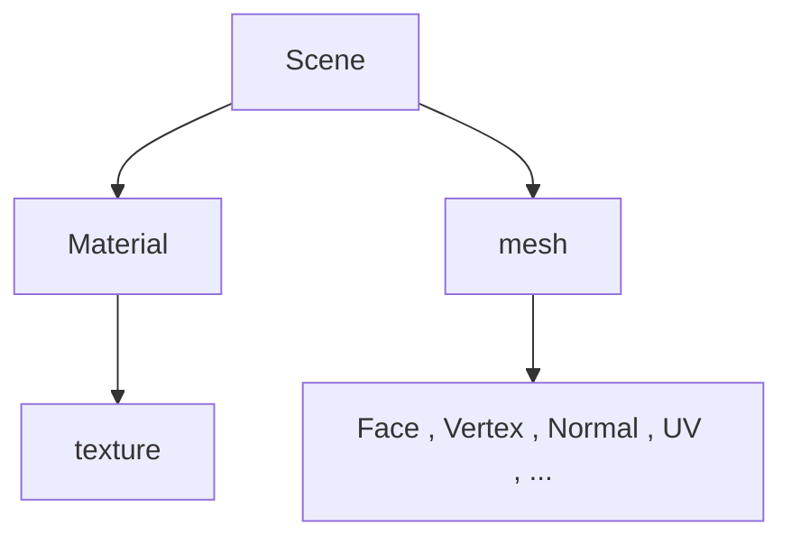

https://assimp.sourceforge.net/lib_html/index.html



其中face 相当于 index

官方代码
```cpp
#include <assimp/Importer.hpp>      // C++ importer interface
#include <assimp/scene.h>           // Output data structure
#include <assimp/postprocess.h>     // Post processing flags
#include "print.h"
bool import(const std::string& pFile)
{
    Assimp::Importer importer;
    const aiScene* scene = importer.ReadFile(pFile,
        aiProcess_CalcTangentSpace |
        aiProcess_Triangulate |
        aiProcess_JoinIdenticalVertices |
        aiProcess_SortByPType);

    if (!scene)
    {
        print(importer.GetErrorString());
        return false;
    }
    print("导入成功");
    return true;
}


int main()
{
    import("./resources/IronMan/IronMan.obj");
}
```

我们首先找到Scene节点，这是一切的基础，

在Scene节点中我们可以找到所有的 mesh 节点。

```cpp
// 得到mesh的长度
// print(scene->mNumMeshes);
int meshNum = scene->mNumMeshes;

//遍历所有的节点 并 得到所有的名字
for( int i = 0 ; i < meshNum ; ++i )
{
	aiMesh* mesh = scene->mMeshes[i];
	print(mesh->mName.C_Str());
}

```

在 `mesh` 中我们可以得到当前mesh的属性以及描述

```cpp
bool import(const std::string& pFile)
{
    Assimp::Importer importer;
    const aiScene* scene = importer.ReadFile(pFile,
        aiProcess_CalcTangentSpace |
        aiProcess_Triangulate |
        aiProcess_JoinIdenticalVertices |
        aiProcess_SortByPType);

    if (!scene)
    {
        print(importer.GetErrorString());
        return false;
    }
    print("导入成功");
    // print(scene->mNumMeshes);
    int meshNum = scene->mNumMeshes;
    // for( int i = 0 ; i < meshNum ; ++i )
    // {
    //
    // }
    aiMesh* mesh = scene->mMeshes[0];
    print(mesh->mName.C_Str());

    print(mesh->mNumVertices);//查看顶点数量

  
    printV3(mesh->mVertices[0]);
    printV3(mesh->mNormals[0]);
    printV2(mesh->mTextureCoords[0][0]);
    if(mesh->HasVertexColors(0))
    {
        printV3(mesh->mColors[0][0]);
    }else
    {
        print("没有顶点色");
    }


    //face
    // print(mesh->mNumFaces);
    // for(size_t i = 0 ; i < mesh->mNumFaces ; ++i)
    // {
    //     aiFace face = mesh->mFaces[i];
    //     for (size_t j = 0 ;j < face.mNumIndices ; ++j)
    //     {
    //         cout << face.mIndices[j] << ", ";
    //     }
    //     cout << endl;
    // }

    //材质

    // aiMaterial* material = scene->mMaterials;
    print(scene->mNumMaterials);
    for(size_t i = 0 ; i < scene->mNumMaterials ; ++i)
    {
        aiMaterial* mat = scene->mMaterials[i];
        printf(mat->GetName().C_Str());
    }
    aiString path;
    print(scene->mMaterials[1]->GetTexture(aiTextureType_DIFFUSE, 0, &path));
    print(path.C_Str());

    return true;
}


```


